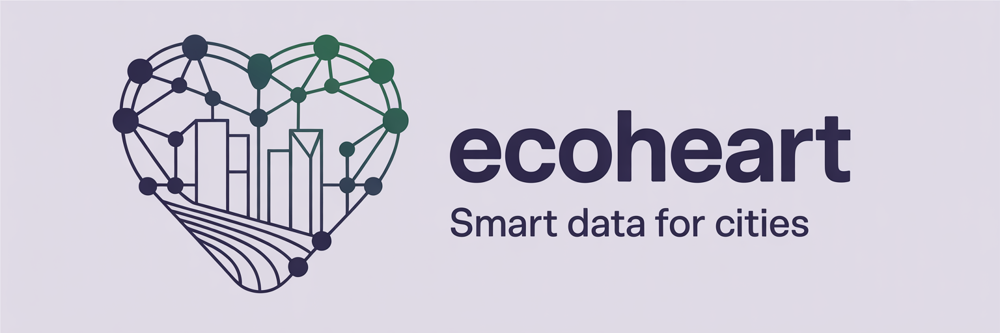

# EcoHeart - City of Olympia AI Researcher

> **AI-powered research assistant for City of Olympia municipal planning, climate action, and sustainability** — Ask questions about 26 indexed city documents covering climate plans, budgets, transportation, infrastructure, and more. Powered by RAG with OpenAI embeddings and AWS S3 Vectors.

**[Live Demo](https://eco-agent-poc.onrender.com)**



## What is This?

EcoHeart's City of Olympia AI Researcher is a proof-of-concept demonstrator that lets city staff, residents, and stakeholders query official City of Olympia planning documents through natural language. Instead of manually searching through thousands of pages of PDFs, users can ask questions like:

- "What are Olympia's greenhouse gas reduction targets for 2030?"
- "Compare the 2024 and 2025 operating budgets"
- "What transportation projects are planned and what are their timelines?"
- "What does the Sea Level Rise Response Plan recommend?"

The system retrieves relevant passages from 26 indexed city documents, cites sources with page numbers, and can generate charts and visualizations from the data.

> This project was forked from [Valyu's Bio biomedical researcher](https://github.com/yorkeccak/bio) and adapted for municipal planning use.

## Indexed Documents

The RAG pipeline has indexed **26 official City of Olympia documents**:

**Climate & Environment (8)**
- Climate Risk and Vulnerability Assessment
- Olympia Sea Level Rise Response Plan
- Olympia Greenhouse Gas Inventory
- Water Quality Report
- Water System Plan
- Stormwater Management Action Plan
- Urban Forestry Manual
- Green Belt Stewardship for HOAs

**Planning & Development (4)**
- Olympia Neighborhood Centers Strategy
- Olympia 2045 Comprehensive Plan Final EIS
- Housing Action Plan
- Public Participation Plan

**Budget & Finance (4)**
- 2025 Adopted Operating Budget
- 2025 Long-Range Financial Projections
- Capital Facilities Plan 2025-2030
- Capital Facilities Plan 2026-2031

**Transportation & Infrastructure (3)**
- Transportation Master Plan
- Street Safety Plan
- Stormwater Site Plans

**Public Safety (3)**
- Natural Hazard Mitigation Plan
- Emergency Management Plan
- Police Department Strategic Plan

**Other Municipal Plans (4)**
- Parks Arts and Recreation Plan
- Waste Resources Management Plan
- Annual City Work Plan
- Tree Density Calculation Guide

## Architecture

```
┌─────────────────────────────────────────────────────┐
│                    Next.js Frontend                  │
│        (Chat UI, Capability Cards, Sidebar)         │
└──────────────┬──────────────────────┬───────────────┘
               │                      │
       POST /api/chat          POST /api/eco-rag
               │                      │
               ▼                      ▼
    ┌──────────────────┐   ┌─────────────────────────┐
    │  OpenAI GPT-4o   │   │     RAG Pipeline         │
    │  (Streaming +    │   │  1. Embed query (OpenAI) │
    │   Tool Calling)  │   │  2. Vector search (S3)   │
    └──────────────────┘   │  3. Top-5 retrieval      │
                           │  4. Context compression  │
                           └─────────────────────────┘

    Tools: RAG Search, Web Search, Chart Creation,
           Python Code Execution (Daytona), CSV Export
```

| Layer | Tech |
|-------|------|
| Frontend | Next.js 15, React 19, Tailwind CSS, Radix UI, Framer Motion |
| AI/Chat | Vercel AI SDK, OpenAI GPT-4o (streaming + tool calling) |
| RAG | OpenAI `text-embedding-3-small` (1024 dims) → AWS S3 Vectors |
| Charts | Recharts (interactive), jsPDF (report export) |
| DB (dev) | SQLite via Drizzle ORM |
| DB (prod) | Supabase (Postgres) |
| Code Exec | Daytona sandboxed Python |
| Deployment | Render |

## Quick Start

### Prerequisites

- Node.js 18+
- OpenAI API key
- AWS credentials (for S3 Vectors RAG index)

### Installation

```bash
git clone https://github.com/ahmedkhan25/eco-agent-poc.git
cd eco-agent-poc
npm install
```

### Environment Variables

Copy `.env.example` to `.env.local` and fill in your keys:

```env
# Required
NEXT_PUBLIC_APP_MODE=development
OPENAI_API_KEY=sk-...

# Optional (for full features)
DAYTONA_API_KEY=...          # Python code execution
VALYU_API_KEY=valyu_...      # Legacy - web search fallback
```

In development mode (`NEXT_PUBLIC_APP_MODE=development`):
- No Supabase or auth required — uses local SQLite
- Auto-login as dev user
- Unlimited queries, no rate limits

### Run

```bash
npm run dev
```

Open [http://localhost:3000](http://localhost:3000).

## Homepage Capability Cards

The homepage shows 6 pre-built prompts that demonstrate key use cases:

| Card | What it does |
|------|-------------|
| **Climate Modeling** | Analyze GHG emissions trends, 2030 reduction targets, emission scenarios |
| **Climate Goals** | Extract climate action goals, adaptation strategies, milestones |
| **Transportation Plans** | Search Transportation Master Plan for projects, budgets, timelines |
| **Budget Analysis** | 2025 operating budget breakdown, fund groups, year-over-year comparison |
| **Infrastructure Plans** | Capital Facilities Plan spending trends 2025-2030 |
| **Doc & Web Search** | General document search + web search fallback |

These are defined in `src/components/chat-interface.tsx` (~line 2760). Each card calls `handlePromptClick()` to pre-fill the chat input with a curated prompt.

## Adding a New Page or Workflow

### Option 1: Add a capability card (simplest)

Add a new card to the homepage grid in `src/components/chat-interface.tsx`:

1. Add an icon image to `public/eco/home-cards/`
2. Duplicate an existing `<motion.button>` block in the capabilities grid
3. Set the icon path, title, subtitle, and pre-filled prompt text

### Option 2: Add a new page route

Create a file at `src/app/your-page/page.tsx`:

```tsx
export default function YourPage() {
  return <div>Your content</div>;
}
// Accessible at /your-page
```

### Option 3: Add a new API endpoint

Create a file at `src/app/api/your-endpoint/route.ts`:

```ts
export async function POST(request: Request) {
  const data = await request.json();
  // Your logic here
  return Response.json({ result: data });
}
// Callable at POST /api/your-endpoint
```

### Option 4: Full workflow page with its own UI

1. Create `src/app/new-workflow/page.tsx` with your UI
2. Import shared components from `src/components/`
3. Call existing APIs (`/api/eco-rag`, `/api/chat`) for RAG and chat
4. Add a navigation link in `src/components/sidebar.tsx`

## RAG Pipeline Details

### Ingestion (offline, Python)

Located in `/RAG/`. Run once to index documents:

```bash
cd RAG
python full_ingestion.py
```

Pipeline:
1. Downloads PDFs from S3 bucket `olympia-plans-raw`
2. Extracts text with PyMuPDF4LLM (markdown format)
3. Chunks by tokens (max 5000 per chunk)
4. Generates embeddings with OpenAI `text-embedding-3-small` (1024 dims)
5. Stores vectors in AWS S3 Vectors index `olympia-pages-idx`

### Query (runtime, TypeScript)

Endpoint: `POST /api/eco-rag`

1. Embed the user query with OpenAI
2. Search S3 Vectors index (top-5 results)
3. Retrieve matching chunks with metadata (doc title, page number, text)
4. Compress context with GPT-4o (max 8000 token summary)
5. Return compressed summary + sources to the chat system prompt
6. Store in `rag_contexts` table for citation tracking

### Adding New Documents to the Index

1. Upload PDFs to the `olympia-plans-raw` S3 bucket
2. Update `RAG/inventory.json` with the new document metadata
3. Re-run `RAG/full_ingestion.py` (or run for specific new docs)
4. Update the system prompt document list in `src/app/api/chat/route.ts` (~line 732)

## Key Files

| File | Purpose |
|------|---------|
| `src/app/page.tsx` | Homepage entry point |
| `src/components/chat-interface.tsx` | Main chat UI + capability cards |
| `src/app/api/chat/route.ts` | Chat streaming endpoint + system prompt |
| `src/app/api/eco-rag/route.ts` | RAG query pipeline |
| `src/lib/tools.ts` | AI tool definitions (charts, code exec, search) |
| `src/lib/db.ts` | Database abstraction (Supabase/SQLite) |
| `src/lib/local-db/schema.ts` | SQLite schema (dev mode) |
| `src/components/sidebar.tsx` | Session history & navigation |
| `src/components/olympia-info-modal.tsx` | "About & Indexed Documents" modal |
| `RAG/full_ingestion.py` | Document ingestion pipeline |
| `RAG/inventory.json` | Indexed document manifest (26 docs) |
| `src/data/inventory.json` | Frontend copy of document inventory |

## Deployment

See [DEPLOYMENT_GUIDE.md](DEPLOYMENT_GUIDE.md) for full Render + Supabase + Google OAuth setup instructions.

### Quick summary:

1. Push to GitHub
2. Create Render Blueprint (detects `render.yaml`)
3. Set environment variables (Supabase, OpenAI, etc.)
4. Configure Google OAuth redirect URIs
5. Deploy

The app is currently deployed at: `https://eco-agent-poc.onrender.com`

## Development vs Production Mode

| Feature | Development | Production |
|---------|------------|------------|
| Database | Local SQLite | Supabase (Postgres) |
| Auth | Auto-login (dev user) | Google OAuth via Supabase |
| Rate limits | None | 5 queries/day (free tier) |
| Billing | Disabled | Polar (optional) |
| Local LLMs | Ollama / LM Studio | No |

Toggle with `NEXT_PUBLIC_APP_MODE=development` or `production` in `.env.local`.

## Legacy / Inherited from Fork

The following are inherited from the Valyu Bio fork and not actively used for the Olympia demonstrator:

- Valyu API integration (biomedical data search) — replaced by Olympia RAG
- PubMed, clinical trials, FDA drug label tools in `tools.ts`
- Polar billing integration
- Biomedical-focused README content (now replaced)
- `bio` package name in `package.json`

## License

MIT — see [LICENSE](LICENSE).

---

Built by [EcoHeart](https://ecoheart.ai) as a proof of concept for AI-assisted municipal planning research.
